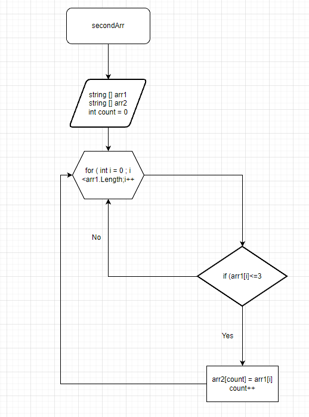

  

# ЗАДАНИЕ

# Написать программу, которая из имеющегося массива строк формирует массив из строк, длина которых меньше либо равна 3 символа. Первоначальный массив можно ввести с клавиатуры, либо задать на старте выполнения алгоритма. При решение не рекомендуется пользоваться коллекциями, лучше обойтись исключительно массивами.

# Объяснение алгоритма 
* Сначала ввёл два массива. Изначальный и второй массив который был такой же длины .
* Сделал метод. Суть которого заключалось  в том , что метод в котором цикл соразмерный длине массива, внутри цикла проводится проверка условия ( <=3 ), если проверка выполняется то элемент первого массива заносится в count элемент второго массива. Переменная count ч поочередно закидывает из первого массива во второй.Также важно , чтобы потом не было пропелов. После присвоения увеличивается переменная count на 1 и возвращается к циклу for в котором i увеличивается на 1. И так проверяется до конца.